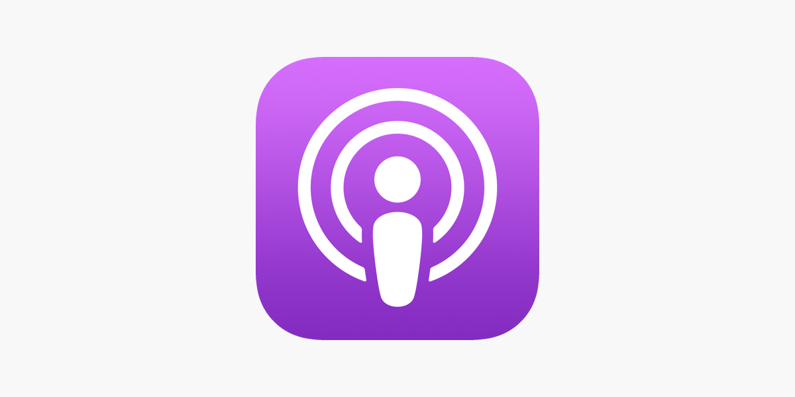

    

<h1 align="center">Podcast_Recommedation</h1>

<h4 align="center">
  <a href="Records.md">Records</a>
  ·
  <a href="Recommedations.md">Recommedations</a>
  ·
  <a href="Notes/">Notes</a>
</h4>

    
    

日常听播客记录 &amp; 精彩播客节目推荐

## 🌟 Preview

## ✨ Features

- File explorer with [Neo-tree](https://github.com/nvim-neo-tree/neo-tree.nvim)
- Autocompletion with [Cmp](https://github.com/hrsh7th/nvim-cmp)

## ⚡ Requirements

- [Nerd Fonts](https://www.nerdfonts.com/font-downloads) (_Optional with manual intervention:_ See [Documentation on customizing icons](https://astronvim.github.io/Recipes/icons))
- [Neovim 0.8 (_Not_ including nightly)](https://github.com/neovim/neovim/releases/tag/v0.8.0)
- [Tree-sitter CLI](https://github.com/tree-sitter/tree-sitter/blob/master/cli/README.md) (_Note:_ This is only necessary if you want to use `auto_install` feature with Treesitter)
- A clipboard tool is necessary for the integration with the system clipboard (see [`:help clipboard-tool`](https://neovim.io/doc/user/provider.html#clipboard-tool) for supported solutions)
- Terminal with true color support (for the default theme, otherwise it is dependent on the theme you are using)
- Optional Requirements:
  - [ripgrep](https://github.com/BurntSushi/ripgrep) - live grep telescope search (`<leader>fw`)
  - [lazygit](https://github.com/jesseduffield/lazygit) - git ui toggle terminal (`<leader>tl` or `<leader>gg`)
  - [go DiskUsage()](https://github.com/dundee/gdu) - disk usage toggle terminal (`<leader>tu`)
  - [bottom](https://github.com/ClementTsang/bottom) - process viewer toggle terminal (`<leader>tt`)
  - [Python](https://www.python.org/) - python repl toggle terminal (`<leader>tp`)
  - [Node](https://nodejs.org/en/) - node repl toggle terminal (`<leader>tn`)

> Note when using default theme: For MacOS, the default terminal does not have true color support. You will need to use [iTerm2](https://iterm2.com/) or another [terminal emulator](https://gist.github.com/XVilka/8346728#terminal-emulators) that has true color support.

## 📦 Basic Setup

## 🗒️ Links

[AstroNvim Documentation](https://astronvim.github.io/)
[Core AstroNvim LUA API Documentation](https://astronvim.github.io/AstroNvim/)

- [Basic Usage](https://astronvim.github.io/Basic%20Usage/walkthrough) is given for basic usage
- [Default Mappings](https://astronvim.github.io/Basic%20Usage/mappings) more about the default key bindings
- [Default Plugin Configuration](https://astronvim.github.io/configuration/plugin_defaults) more about the provided plugin defaults
- [Advanced Configuration](https://astronvim.github.io/configuration/config_options) more about advanced configuration

